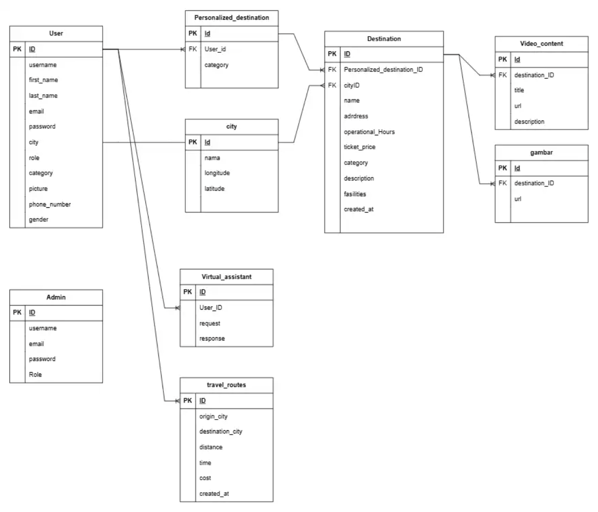
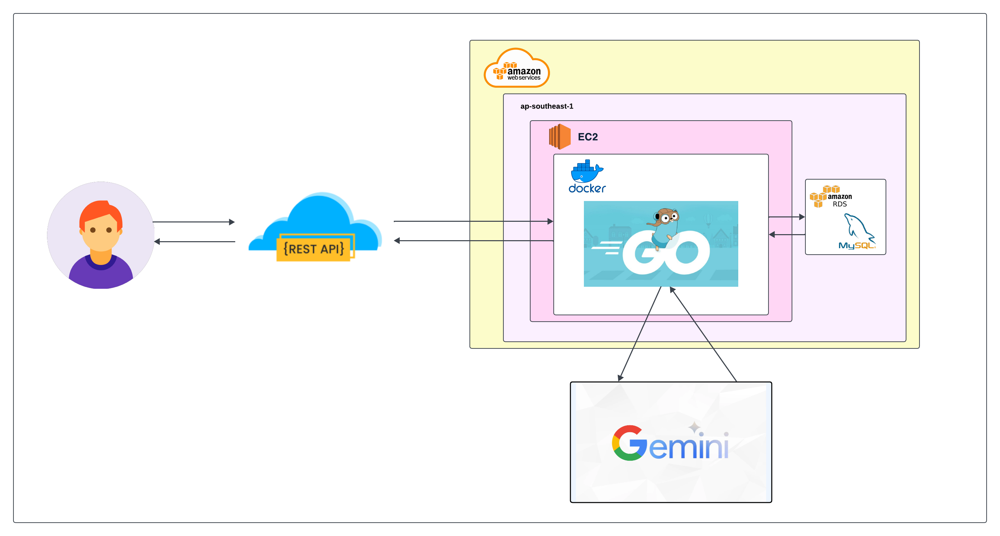

## TripWise 
TripWise hadir sebagai solusi inovatif, sebuah platform berbasis web yang dirancang untuk membantu wisatawan merencanakan perjalanan dengan lebih mudah, cepat, dan terorganisir, melalui fitur pencarian destinasi yang lengkap, informasi detail tentang setiap tempat wisata, serta kemampuan untuk mencari destinasi di kota tertentu secara efisien dan sesuai kebutuhan.

## Entity Relationship Diagram (ERD)
Berikut adalah Entity Relationship Diagram (ERD) untuk aplikasi PlantPal yang mengelola data pengguna, tanaman, kondisi tanaman, dan saran perawatan.

### ERD Diagram

### Penjelasan ERD
#### **Tabel dan Relasi**
1. **Users**
   - **Tabel ini menyimpan informasi pengguna aplikasi.**
     - `id` (integer): Primary key.
     - `username` (varchar): Nama pengguna.
     - `first_name` (varchar): Nama depan pengguna.
     - `last_name` (varchar): Nama belakang pengguna.
     - `email` (varchar): Alamat email pengguna.
     - `password` (varchar): Kata sandi pengguna.
     - `city` (varchar): Kota tempal tinggal pengguna.
     - `role` (varchar): Peran pengguna.
     - `category` (varchar): Kategori pengguna.
     - `picture` (varchar): Gambar profil pengguna.
     - `phone_number` (varchar): Nomor telepon pengguna.
     - `gender` (varchar): Jenis kelamin pengguna.
   - **Relasi:**
     - Satu pengguna memiliki banyak Personalized_destination (one-to-many).
     - Satu pengguna memiliki banyak Virtual_assistant (one-to-many).

2. **Personalized_destination**
   - **Tabel ini menyimpan destinasi yang dipersonalisasi untuk pengguna.**
     - `id` (integer): Primary key.
     - `user_id` (integer): Foreign key ke tabel User.
     - `category` (varchar): Kategori destination.
   - **Relasi:**
     - Satu Personalized_destination memiliki banyak Destination (one-to-many).

3. **Desination**
   - **Tabel ini menyimpan informasi destinasi.**
     - `id` (integer): Primary key.
     - `Personalized_destination_ID` (integer): Foreign key ke Personalized_destination.
     - `cityID` (integer): Foreign key ke city.
     - `name` (varchar): Nama destination.
     - `address` (varchar): Alamat destination.
     - `operational_Hours` (varchar): Jam operasional destinasi.
     - `category` (varchar): Kategori destination.
     - `description` (text): Deskripsi destination.
     - `facilities` (text): Fasilitas yang tersedia.
     - `created_at` (timestamp): Waktu pembuatan data.
   - **Relasi:**
     - Satu Destination memiliki banyak Video_content (one-to-many).
     - Satu Destination memiliki banyak gambar (one-to-many).

4. **Video_content**
   - **Tabel ini menyimpan konten video terkait destinasi.**
     - `id` (integer): Primary key.
     - `destination_ID` (integer): Foreign key ke tabel Destination.
     - `title` (varchar): Judul video.
     - `url` (varchar): URL video.
     - `description` (text): Deskripsi video.

5. **gambar**
   - **Tabel ini menyimpan gambar yang berkaitan dengan destinasi.**
     - `id` (integer): Primary key.
     - `destination_ID` (integer): Foreign key ke tabel Destination.
     - `url` (varchar): URL video.

6. **city**
   - **Tabel ini menyimpan data kota.**
     - `id` (integer): Primary key.
     - `nama` (varchar): Nama kota.
     - `longitude` (float): Garis bujur kota.
     - `latitude` (float): Garis lintang kota.

7. **Virtual_assistant**
   - **Tabel ini menyimpan data asisten virtual yang melayani permintaan pengguna.**
     - `id` (integer): Primary key.
     - `User_ID` (integer): Foreign key ke User.
     - `request` (text): Permintaan pengguna.
     - `response` (text): Respon dari sistem.

8. **travel_routes**
   - **Tabel ini menyimpan rute perjalanan antara kota.**
     - `id` (integer): Primary key.
     - `origin_city` (varchar): Kota asal.
     - `desination_city` (varchar): Kota tujuan.
     - `distance` (float): Jarak antara dua kota.
     - `time` (float): Waktu tempuh.
     - `cost` (decimal): Biaya perjalanan.
     - `created_at` (timestamp): Waktu pencatatan rute.

#### **Relasi Antar Tabel**
- **Users → Personalized_destination**: Relasi one-to-many.
- **User → Virtual_assistant**: Relasi one-to-many.
- **Personalized_destination → Destination**: Relasi one-to-many.
- **Destination → Video_content**: Relasi one-to-many.
- **Destination → gambar**: Relasi one-to-many.
- **Destination → city**: Relasi many-to-one.
- **travel_routes → city**: Menggunakan kota asal dan tujuan.

---

## High-Level Architecture Diagram (HLA)

### **Deskripsi Umum**
High-Level Architecture Diagram (HLA) untuk aplikasi PlantPal memberikan gambaran menyeluruh tentang alur kerja dan komponen utama dalam sistem backend. Diagram ini mencakup proses pengelolaan pengguna, tanaman, pencatatan kondisi tanaman, dan integrasi dengan layanan eksternal untuk rekomendasi perawatan berbasis AI.

### Komponen Utama

Komponen Utama dari Arsitektur Aplikasi Ini Meliputi:
- **Backend API**: Server RESTful yang ditulis dalam Golang menggunakan framework Echo untuk menangani proses bisnis, autentikasi pengguna, dan pengelolaan data produk serta analisis konsumsi plastik.
- **Database**: Penyimpanan data terstruktur menggunakan MySQL yang di-hosting di Amazon RDS untuk skalabilitas dan pemeliharaan yang mudah. Menyimpan data pengguna, catatan produk, dan hasil analisis konsumsi plastik.
- **External Services**: Menggunakan Gemini API untuk memberikan rekomendasi produk alternatif bebas plastik, serta integrasi dengan layanan lain untuk fitur AI. Seperti AI untuk deskripsi produk.

#### **API Eksternal (Gemini)**
- Layanan pihak ketiga yang digunakan untuk memberikan saran perawatan berbasis AI berdasarkan data kondisi tanaman yang dikirimkan dari backend.
